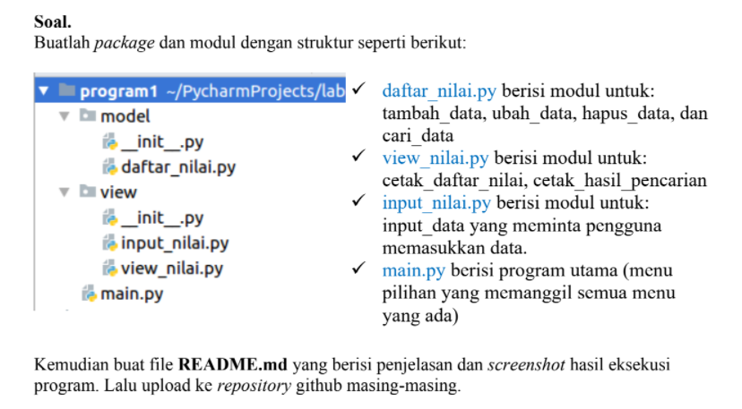

# Program1

## UAS Bahasa pemprogaman-python
```py
__Nama  : Leman__

__Nim   : 312110148__

__Kelas : T1.21.C1__
```
 ## Soal
 

 ## Membuat package dan Modul
 ### Pertama kita buat folder utama yakni Program1, yang didalamnya terdapat folder model,view,dan main.py
 ### kemudian di dalam folder model kita buat program daftar_nilai.py seperti berikut
 ```py
 from view.input_nilai import *

dataMahasiswa = {}


def tambah():
    global dataMahasiswa
    nama = input_nama()
    nim = input_nim()
    nilaiTugas = input_nilaiTugas()
    nilaiUts = input_nilaiUts()
    nilaiUas = input_nilaiUas()
    nilaiAkhir = (0.30 * nilaiTugas) + (0.35 * nilaiUts) + (0.35 * nilaiUas)
    dataMahasiswa[nama] = nim, nilaiTugas, nilaiUts, nilaiUas, nilaiAkhir
    print("\nBerhasil menambahkan data!")
    return dataMahasiswa

def ubah():
    nama = input("Masukkan Nama: ")
    if nama in dataMahasiswa.keys():
        nim = input_nim()
        nilaitugas = input_nilaiTugas()
        nilaiUts = input_nilaiUts()
        nilaiUas = input_nilaiUas()
        nilaiAkhir = (0.30 * nilaiTugas) + (0.35 * nilaiUts) + (0.35 * nilaiUas)
        dataMahasiswa[nama] = nim, nilaiTugas, nilaiUts, nilaiUas, nilaiAkhir
        print("\nBerhasil mengubah data!")
    else:
        print("Data tidak ditemukan!")


def hapus():
    nama = input("Masukkan Nama:  ")
    if nama in dataMahasiswa.keys():
        del dataMahasiswa[nama]
        print("Data",nama, "Telah dihapus!")
    else:
        print("Data Mahasiswa Tidak Ada")
 ```
### Selanjutnya di dalam folder view buat program input_nilai.py dan view_nilai.py
- program input_nilai.py
```py
def input_nama():
    global nama
    nama = input("Masukkan Nama        : ")
    return nama


def input_nim():
    global nim
    nim = input("Masukkan NIM         : ")
    return nim


def input_nilaiTugas():
    global nilaiTugas
    nilaiTugas = int(input("Masukkan Nilai Tugas : "))
    return nilaiTugas


def input_nilaiUts():
    global nilaiUts
    nilaiUts = int(input("Masukkan Nilai UTS   : "))
    return nilaiUts


def input_nilaiUas():
    global nilaiUas
    nilaiUas = int(input("Masukkan Nilai UAS   : "))
    return nilaiUas
```
- dibawah ini adalah program view_nilai.py
```py
from model.daftar_nilai import *


def lihat():
    if dataMahasiswa.items():
        print("\n                      DAFTAR NILAI MAHASISWA                    ")
        print("==================================================================")
        print("| No |     Nama     |    NIM    | Tugas |  UTS  |  UAS  |  Akhir |")
        print("==================================================================")
        i = 0
        for x in dataMahasiswa.items():
            i += 1
            print(f"| {i:4} | {x[0]:13s} | {x[1][0]:17} | {x[1][1]:10d} |  {x[1][2]:6d} | {x[1][2]:7d} | {x[1][4]:6.2f} | ")
        print("==================================================================")
    else:
        print("\n                      DAFTAR NILAI MAHASISWA                    ")
        print("==================================================================")
        print("| No |     Nama     |    NIM    | Tugas |  UTS  |  UAS  |  Akhir |")
        print("==================================================================")
        print("|                          TIDAK ADA DATA!                       |")
        print("==================================================================")


def cari():
    nama = input("Masukkan Nama        : ")
    if nama in dataMahasiswa.keys():
        print("\n                   DAFTAR NILAI MAHASISWA                   ")
        print("==============================================================")
        print("|     Nama     |    NIM    | Tugas |  UTS  |  UAS  |  Akhir  |")
        print("==============================================================")
        print("| {0:12s} | {1:9s} | {2:5} | {3:5} | {4:5} | {5:6}  |".format(nama, dataMahasiswa[nama][0], dataMahasiswa[nama][1], dataMahasiswa[nama][2], dataMahasiswa[nama][3], dataMahasiswa[nama][4]))
        print("==============================================================")
    else:
        print("Datanya {0} Tidak Ada ".format(nama))
```
### Terakhir di dalam folder program1, kita buat program main.py untuk menjalankan program daftar nilai yang kita buat
- program ini berfungsi untuk menangkap input dari user, jika t(tambah data),u(ubah data),c(cari data),h(hapus data),l(lihat data),k(keluar dari program)
```py
from view.view_nilai import *

while True:
    c = input("\nT)ambah, U)bah, C)ari, H)apus, L)ihat, K)eluar: ")

    if c.lower() == 't':
        tambah()

    elif c.lower() == 'u':
        ubah()

    elif c.lower() == 'c':
        cari()

    elif c.lower() == 'h':
        hapus()

    elif c.lower() == 'l':
        lihat()

    elif c.lower() == 'k':
        print("====Anda keluar dari Program====")
        break

    else:
        print("Menu yang anda maksud tidak tersedia, Silahkan pilih menu yang tersedia")
```

